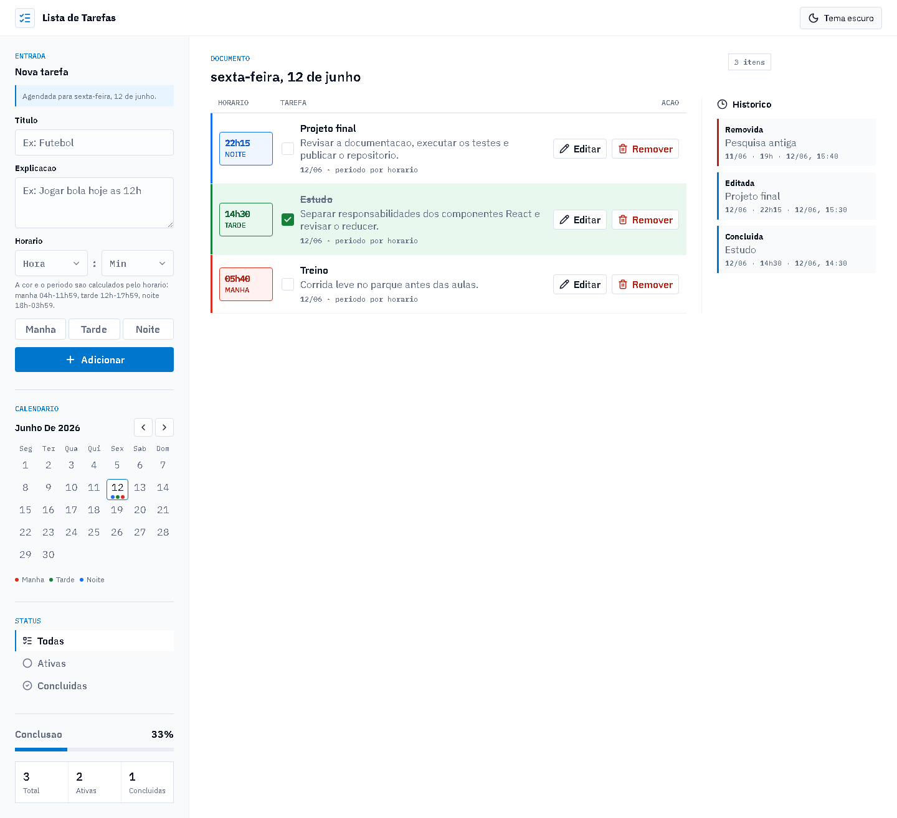

# Lista de Tarefas com Tema Dinamico

Aplicacao academica desenvolvida com React, JavaScript e styled-components.

O projeto permite organizar tarefas por data, horario e status. A interface usa tema claro e escuro, calendario mensal, historico de movimentacoes e classificacao visual por periodo do dia.

## Acesso

Aplicacao publicada no GitHub Pages:

https://victorzinn704.github.io/Gerenciador-de-Tarefas-/

## Estado validado

Validacao local registrada em 2026-06-16:

```bash
npm ci
npm run lint
npm run test
npm run build
```

Resultado: lint sem erro, 3 arquivos de teste aprovados, 11 testes aprovados e build de producao gerado.

## Imagens do projeto

### Desktop



### Mobile


## Funcionalidades

- Adicionar tarefas com titulo, explicacao, data e horario.
- Marcar tarefas como concluidas.
- Editar tarefas ja cadastradas.
- Remover tarefas.
- Filtrar por todas, ativas e concluidas.
- Selecionar datas em calendario mensal.
- Consultar historico de criacao, edicao, conclusao, reabertura e remocao.
- Alternar entre tema claro e tema escuro.
- Classificar tarefas por periodo do dia com cores.

## Regra de periodos

O periodo da tarefa e calculado automaticamente pelo horario selecionado.

| Periodo | Horario | Cor |
| --- | --- | --- |
| Manha | 04h00 a 11h59 | Vermelho |
| Tarde | 12h00 a 17h59 | Verde |
| Noite | 18h00 a 03h59 | Azul |

Esta regra foi definida para deixar a agenda simples e previsivel. As referencias usadas indicam que os periodos do dia podem variar conforme rotina, luz natural e contexto local.

## Tecnologias

- React
- JavaScript
- styled-components
- Vite
- Vitest
- Testing Library
- lucide-react

## Como executar

Requisitos:

- Node.js 22 ou superior;
- npm.

```bash
npm install
npm run dev
```

Depois, acesse a URL exibida no terminal.

## Scripts disponiveis

```bash
npm run dev
npm run lint
npm run test
npm run test:coverage
npm run build
npm run preview
```

## Qualidade

O projeto possui verificacao automatica de lint, testes e build.

```bash
npm run lint
npm run test
npm run build
```

Tambem existe um workflow do GitHub Actions em `.github/workflows/quality.yml`.

## Publicacao

O projeto e publicado automaticamente no GitHub Pages pelo workflow `.github/workflows/pages.yml`.

A cada envio para a branch `main`, o GitHub executa os testes, gera o build de producao e publica o conteudo da pasta `dist`.

## Estrutura principal

```text
src/
├── components/
├── hooks/
├── styles/
├── test/
├── utils/
├── App.jsx
└── main.jsx
```

Documentos complementares:

- `docs/INDEX.md`
- `docs/GUIA-DE-USO.md`
- `docs/REGRAS-DE-NEGOCIO.md`
- `docs/ESTRUTURA.md`
- `docs/DECISOES-TECNICAS.md`
- `docs/TESTES.md`
- `docs/MATRIZ-DE-TESTES-E-EVIDENCIAS.md`
- `docs/VALIDACAO-LOCAL.md`
- `docs/AUDITORIA-DOCUMENTAL-2026-06-16.md`

## Observacao sobre dados

Os dados sao salvos no `localStorage` do navegador. O projeto nao utiliza backend, banco de dados ou autenticacao.

## Limites conhecidos

- Os dados nao sincronizam entre dispositivos.
- Limpar os dados do navegador pode apagar as tarefas salvas.
- O projeto nao possui login, API ou banco de dados.
- O objetivo e demonstrar uma agenda local com regras de horario, historico e tema visual.
